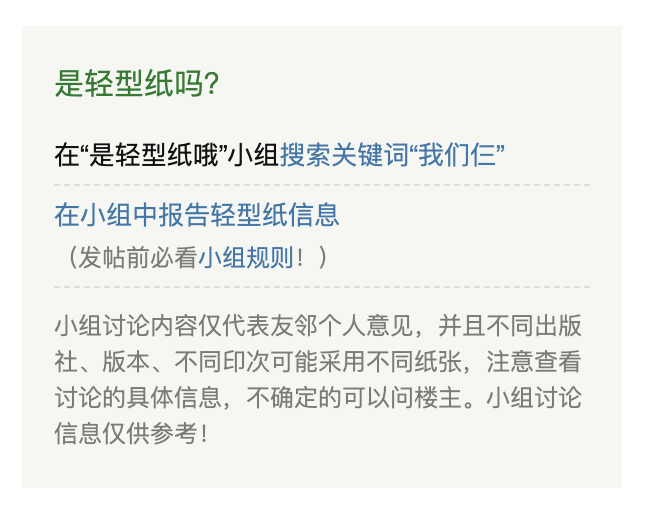

# whats-the-paper “是轻型纸哦”查询助手

这是一个在豆瓣小组<a target="_blank" href="https://www.douban.com/group/731560/">“是轻型纸哦”</a>中搜索某本书是否是轻型纸的 Chrome 插件。

This is a Chrome Extension to search for the discussion on Douban whether a book is made with light weight paper.

## 插件截图

目前插件的功能比较简单，在浏览豆瓣读书的书籍页面时，会根据书名在右侧生成一些信息，链接到小组对于书名的讨论。但是不同出版社、不同版本等的纸质是不同的，需要用户自行甄别，小组讨论内容来自豆瓣用户，仅供参考。



## 下载链接

### Chrome 扩展应用商店

[下载链接](https://chrome.google.com/webstore/detail/%E6%98%AF%E8%BD%BB%E5%9E%8B%E7%BA%B8%E5%93%A6%E6%9F%A5%E8%AF%A2%E5%8A%A9%E6%89%8B/pbocpfliejhopggmmiagbeblonopmoak)

### 手动安装（如果应用商店无法下载）

如果上面的链接无法下载，可以使用开发者模式本地加载（后续需要手动更新）。

方法：下载本项目，在 Chrome 中打开 `chrome://extensions/` 右上角打开开发者模式，加载已解压的扩展程序，选择下载后的本项目 `dist` 目录。

## 什么是轻型纸？为什么要了解一本书是否是轻型纸？

轻型纸与同等厚度的普通胶版纸相比更轻，因而得名。当然，轻型纸和其他胶版纸都可以做成不同克重，质量差异也很大，不一而论。

近些年，轻型纸被越来越多在意纸张的读者诟病容易发黄长斑，“保质期”相比普通的胶版纸短很多倍。但是用轻型纸做的书通常可以更厚，让一本书看起来更“值”它的定价，因而在近些年受到一些出版社的青睐。但是很多知情的读者并不买账（大部分人可能并没有听说过“轻型纸”，还以为书发黄是自己没保存好），毕竟大部分人不会愿意出更多的钱买保质期更短的商品。

当然，轻型纸也并不是没有优点，比如因为更轻而更适合携带（虽然有人会吐槽其厚度又为便携性减分了），某些质量比较好的轻型纸手感也是不错的。但是让人不能接受的是，有些出版社或者商家会在商品详情以及咨询客服是否是轻型纸的时候，以“胶版纸”或模棱两可的答案回复（轻型纸又称轻型胶版纸），导致信息不对称，损害了消费者的知情权。

本人个人的立场并不是“抵制”轻型纸，而是相信消费者有权利在购买前拥有对纸质的知情权。所以，建立了“是轻型纸哦”豆瓣小组以及这个插件，希望以社区信息共享的形式，让“一本书是否是轻型纸”的信息公开透明，（尽绵薄之力）消除这种信息不对称性。至于你是喜欢轻型纸还是反对轻型纸，我认为每个人都有权利表达自己的态度，我也尊重这种不同的态度。

（以我浅薄而很可能不正确的观点看来）出版社无非是出于经济因素选择轻型纸，而在消费者知情的情况下，以自己的购买行为表达自己的态度，最终也会从经济角度影响出版社的选择。个人行为的影响力是非常有限的，但宏观的经济效应都是由个体的微观行为积累的，消费者虽然是弱势群体，但也绝不是无能为力的。

## 开发调试

如需本地运行：

```
npm install
npm run build
```

详见 `package.json`。
